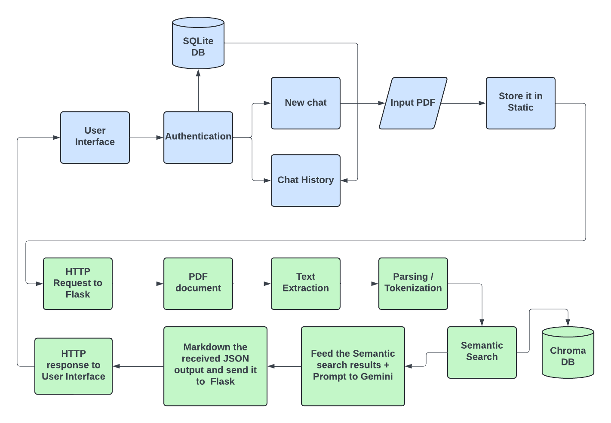
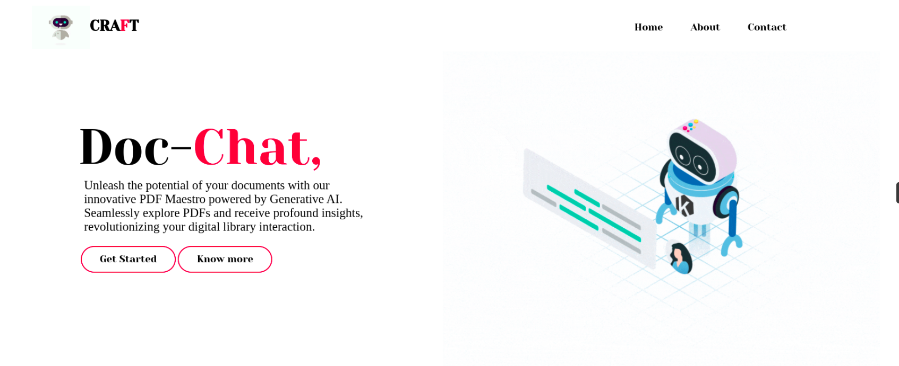
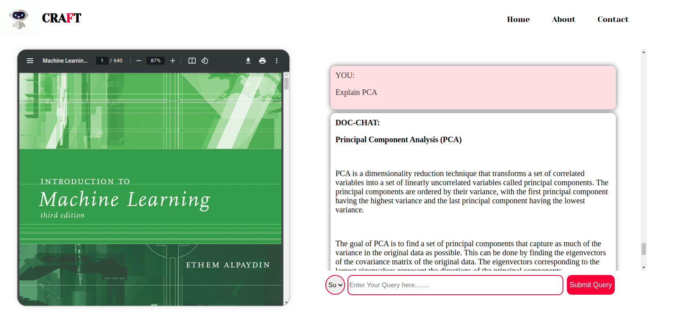

# PDF Chatbot using RAG

This repository contains code for a PDF chatbot implemented using the RAG (Retrieval-Augmented Generation) architecture. The chatbot is designed to answer questions, summarize passages, create flashcards, and generate quiz questions based on text extracted from PDF documents.

## Architecture Overview

The PDF chatbot architecture consists of the following components:

1. **Document Parsing and Embedding**: PDF documents are parsed using the `PyPDFLoader` to extract text content. The text is then embedded using Google's Generative AI Embeddings (`GoogleGenerativeAIEmbeddings`) to represent documents in a semantic space.

2. **Chroma Database**: The embedded text data is stored in a Chroma database (`Chroma`) for efficient retrieval based on semantic similarity.

3. **User Query Handling**: When a user query is received, the chatbot selects an appropriate response generation strategy based on the user's chosen option.

4. **Response Generation Strategies**:
    - **Summarization**: A summary of the relevant passage is generated by condensing key information while maintaining clarity and conciseness.
    - **Question and Answer**: The chatbot generates responses in the form of complete sentences, providing comprehensive answers to questions posed by the user.
    - **Flashcard Creation**: Essential information and key points from the passage are extracted to create flashcards for easy memorization.
    - **Quiz Question Generation**: Quiz questions with multiple-choice answers are generated based on the content of the passage.

5. **Retrieval and Generation**: The RAG architecture is utilized for response generation. A retrieval chain is employed to retrieve relevant passages from the Chroma database based on the user query. The retrieved passages are then used to generate responses using a language model (specifically, Google's Generative AI model).

## Usage

### Requirements
- Python 3.x
- Required Python packages (install using `pip install -r requirements.txt`)

### Setup
1. Set up Google API Key: Obtain a Google API key and replace `'YOUR-GOOGLE-API-SECRET-KEY'` with your actual API key in the `__init__` method of the `PDFChat_RAG` class.

Sure, here's a comprehensive README file for your Flask application:


# Flask App Structure

This Flask application implements a PDF chatbot using the RAG (Retrieval-Augmented Generation) architecture. The chatbot is capable of answering questions, summarizing passages, creating flashcards, and generating quiz questions based on text extracted from PDF documents.

## Features

- **Question Answering**: Provides comprehensive answers to user queries based on the content of PDF documents.
- **Summarization**: Generates concise summaries of passages extracted from PDF documents.
- **Flashcard Creation**: Creates flashcards containing essential information and key points from PDF documents for easy memorization.
- **Quiz Question Generation**: Designs quiz questions with multiple-choice answers based on the content of PDF documents.

## Workflow



## Installation

1. Install the required dependencies listed in `requirements.txt`:
    ```bash
    pip install -r requirements.txt
    ```

2. Initialize the database by running `db_init.py`:
    ```bash
    python db_init.py
    ```

## Usage

1. After installing dependencies and initializing the database, you can run the Flask application by executing:
    ```bash
    python3 app.py
    ```

2. Access the application in your browser at `http://localhost:5000`.

3. Upload a PDF document and choose from the available options (question answering, summarization, flashcard creation, or quiz question generation).

4. Enter your query or select other relevant details as required.

5. Submit your query to receive the generated response.

Got it! Here's the updated directory structure section in the README file to include the additional folders:

## Directory Structure

```
├── app.py
├── db
│   └── chatdb2.db
├── db_init.py
├── model.py
├── README.md
├── requirements.txt
├── static
│   ├── assets
│   │   ├── animatedback1.png
│   │   ├── asistente-robot.gif
│   │   ├── book-transparent.gif
│   │   ├── Gifelement.gif
│   │   ├── mascot2.gif
│   │   ├── mascot.gif
│   │   ├── robot.gif
│   │   ├── uploadpdf.webp
│   │   └── Workflow.png
│   └── css
│       └── index.css
└── templates
    ├── chatpage1.html
    ├── chatpage.html
    ├── dashboard.html
    ├── home.html
    ├── indexf.html
    ├── index.html
    ├── login.html
    ├── newchatpage.html
    └── signup.html

```


## Example Outputs

### Front End


### Chatbot Answer


## License

This project is licensed under the MIT License - see the [LICENSE](LICENSE) file for details.

